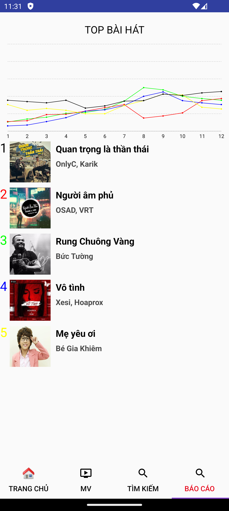

## 💝 Ủng hộ tôi

### Nếu bạn thấy dự án của tôi hữu ích và muốn ủng hộ tôi, hãy quét mã QR bên dưới:

|                                                                              |  |  |  |
|-------------------------------------------------------------------------------------------------------------------------------|-----------------------------------|---------------------------------------------------|-----------------------------------|
| **Momo:&nbsp;&nbsp;&nbsp;&nbsp;&nbsp;&nbsp;&nbsp;&nbsp;&nbsp;&nbsp;&nbsp;&nbsp;&nbsp;&nbsp;<br/>0981054498 - NGUYEN ANH DAT** | **Thank you 🙌**                  | **Techcombank:<br/>1981054498 - NGUYEN ANH DAT**  | **Thank you 🙌**                  |

### Cảm ơn sự hào phóng của bạn! 🙌

---

## Giới thiệu ứng dụng MyMusic

### Mô tả

- Ứng dụng **MyMusic** là một bài tập lớn của tôi, ngôn ngữ lập trình là `Android - Java`. Tôi code cơ bản và dễ hiểu, phù hợp với ai mới học. Tôi cũng đã cập nhật, bạn chỉ cần tải về và chạy. Bạn có thể dùng **MyMusic** như một tài liệu tham khảo hoặc dùng làm bài tập của mình.
- Ứng dụng **MyMusic** có các tính năng cơ bản của một ứng dụng nghe nhạc.
- Ứng dụng **MyMusic** sử dụng các file json để làm backend. Thư mục **assets > mock** chứa các file json, có tên trùng với endpoint của các API. Dữ liệu của file json chính là dữ liệu trả về của API. Do chưa có thời gian nên tôi chưa viết API mà dùng cách này. Bạn có thể tự viết API để làm bài tập tốt hơn.

### Lưu ý:

- File `BaiHatDuocYeuThich.php.json` chứa link các bài hát mà tôi lấy từ ZingMP3. Các link này có thể hết hạn khi bạn chạy ứng dụng và gây chết ứng dụng. Bạn hãy cập nhật các link này để **MyMusic** hoạt động bình thường.

`BaiHatDuocYeuThich.php.json`
   ```java
    {
        "IdBaiHat": "1",
        "TenBaiHat": "Lạc Trôi",
        "HinhBaiHat": "https://avatar-ex-swe.nixcdn.com/playlist/2024/03/15/5/7/0/4/1710500795311_500.jpg",
        "CaSi": "Sơn Tùng M-TP",
        "LinkBaiHat": "https://a128-z3.zmdcdn.me/756ba39ea07eb46c326b54c999668a94?authen=exp=1733308733~acl=/756ba39ea07eb46c326b54c999668a94*~hmac=c3a85d8fbffd94f2e89738e00043cc06&fs=MHx3ZWJWNXwxMDMdUngNTmUsICdUngMjIxLjI3&filename=Lạc%20Trôi%20-%20Sơn%20Tùng%20M-TP.mp3",
        "LuotThich": "528374"
    }
   ```
cập nhật:
   ```java
    {
        "IdBaiHat": "1",
        "TenBaiHat": "Lạc Trôi",
        "HinhBaiHat": "https://avatar-ex-swe.nixcdn.com/playlist/2024/03/15/5/7/0/4/1710500795311_500.jpg",
        "CaSi": "Sơn Tùng M-TP",
        "LinkBaiHat": "https://a128-z3.zmdcdn.me/756ba39ea07eb46c326b54c999668a94?authen=exp=1734249243~acl=/756ba39ea07eb46c326b54c999668a94*~hmac=2af654fafb6c29c8580365256838ea8e&fs=MHx3ZWJWNXwxMDMdUngNTmUsICdUngMjIxLjI3&filename=Lạc%20Trôi%20-%20Sơn%20Tùng%20M-TP.mp3",
        "LuotThich": "528374"
    }
   ```
- Phiên bản cũ **exp=`1733308733`** => phiên bản mới **exp=`1734249243`**

#### Màn hình

|  |  |  |  | 
|----------------------------------|----------------------------------|----------------------------------|----------------------------------|
